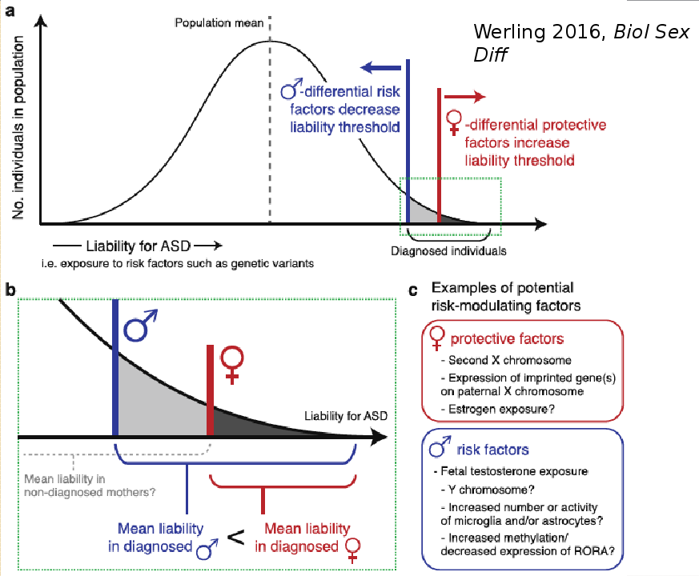
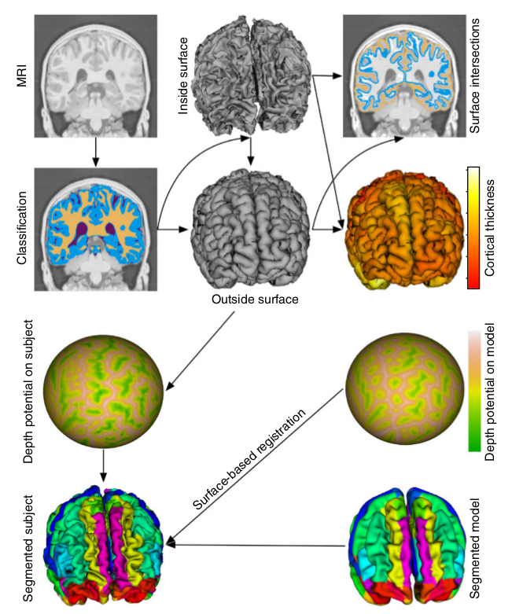
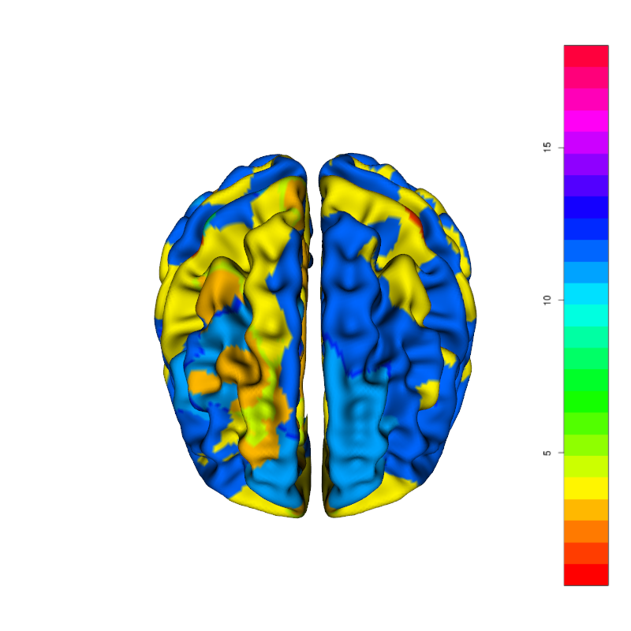
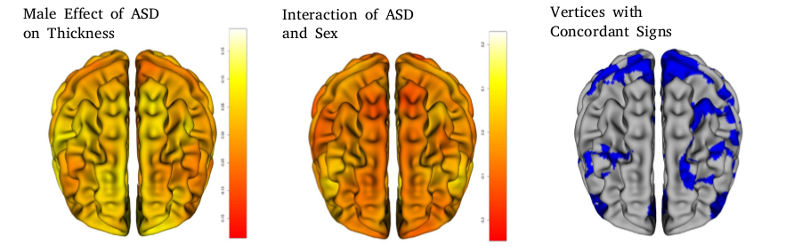
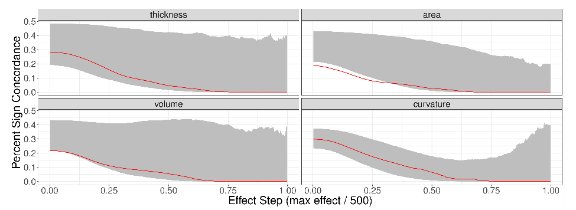
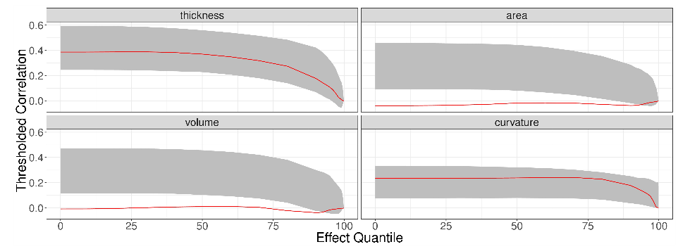

```{r setup, include=FALSE}
knitr::opts_chunk$set(echo = FALSE)
```

---

\centering{ \color{red} \huge{\textit{ Caveat Auditor}!}}
\vspace{12pt}

This presentation is about methods, all results should be treated as placeholders!

## POND


- The Province of Ontario Neurodevelopmental Disorders Network
- Cross disorder initiative to study ASD, attention deficit/hyperactivity
  disorder, obsessive compulsive disorder, and intellectual disability
- Sites in Toronto, Hamilton, London, and Kingston
- Battery of phenotyping with behaviour, genetics, and brain imaging

## Intro

- Autism Spectrum Disorder (ASD) is characterized by difficulties in social communication
  presenting at an early age
- **ASD effects 2-5 times as many males as females**
- Studies examining the differential effect of ASD on neuroanatomy in males and females 
  are typically underpowered.
- We are presently examining the differential effect of ASD in both sexes with a large
  (the largest?) cohort of ASD females acquired at a single site.

---

\huge{So why is ASD so much less common in females?}

## Why the diagnosis differences?

>- Differences in number of risk factors?
>- Some evidence of increased copy number variant load in females with ASD relative
   to males
>- Differences in neurobiological etiology?
>- Broad range of experiments showing qualitative differences between males and 
   females with ASD
   
## Hypothesis 1: Difference in Number of Risk Factors



## Hypothesis 2: Sex Dependent Risk Factors

- Maybe the risk factors for ASD are just different for females

## Two Models

>- Differences could be quantitative: females with ASD have larger cortical differences

\vspace{12pt}

>- Differences could be qualitative: females with ASD have a different pattern of cortical differences
   
  
## Pointed hypotheses

>- If the quantative model is true then across the brain there are more spatial locations
  with female > male conditional effects of ASD than you'd expect by chance
>- alternatively, if the null holds you'll get as many or more spatial locations where the
  male effect is larger
>- If the qualitative model is true then the spatial distribution of female conditional
  effects will be less correlated with the male effects than you'd expect by chance.
>- alternatively, if the signals are more correlated than you expect there's no evidence
  that the whole brain spatial distribution is different.
  
---

Spatial Patterns of What?

\vspace{12pt}
A brief digression into CIVET

## CIVET

- Pipeline for measuring anything cortical in humans
- Starts with some preprocessing 
- Subjects are registered to ICBM
- Tissue classification into grey matter, white matter, and CSF
- A surface is fit to the grey-white interface
- The surface is expanded to the grey-CSF interface
- Cortical thickness, area, volume, and curvature can
  be computed from the two surfaces.

## CIVET



## The Data

- Assembled from POND data and Margot Taylor's subjects
- Grand total of 1356 T1 scans (many longitudinal)
- After CIVET QC and de-longitudinalization 680 scans remain 
\vspace{12pt}
- **226** ASD males
- **193** control males
- **59** ASD females
- **202** control females

---

I have my measures of interest, what now?

## Dealing with non-experimental data

- Humans are highly variable
- ASD status is not randomly assigned
\vspace{12pt}
- Need to fend off omitted variable bias
- Need to deal with missing data
- Need to account for covariate heterogeneity
- Need to choose the best model

## Dealing with non-experimental data

- Humans are highly variable
- ASD status is not randomly assigned
\vspace{12pt}
- \color{red} Need to fend off omitted variable bias


## Omitted variable bias

- The bias in parameter estimates introduced when important
  information is left out of the model.
- Key covariates:
    1. Subject age
    2. IQ
    3. Whole brain volume
    
## Dealing with non-experimental data

- Humans are highly variable
- ASD status is not randomly assigned
\vspace{12pt}
- Need to fend off omitted variable bias
- \color{red} Need to deal with missing data

## Missing Data

- Many subjects are missing IQ (~ 13% )
- Most principled solution is Multiple Imputation

## Multiple Imputation in Brief

- A distribution of IQ given the other covariates is generated for the 
  data.
- Draws from this distribution are used to complete the data set
- Do this multiple (e.g. 5) times 
- Run your analysis on each imputed set 
- Pool results across sets

## Dealing with non-experimental data

- Humans are highly variable
- ASD status is not randomly assigned
\vspace{12pt}
- Need to fend off omitted variable bias
- Need to deal with missing data
- \color{red} Need to account for covariate heterogeneity

  
## Accounting for Covariate Heterogeneity

- Mis-matches in covariate distributions biases analysis
- One potential solution is matching preprocessing
- In ideal cases reduces bias and the degree to which the
  choice of model impacts parameter estimates
- Many approaches, nearest neighbour matching, inverse probability weighting,
  coarsened exact matching, and full matching to name a few
- I used full matching
  
## Full matching

- Choose a distance measure, most common are propensity score
  and mahalanobis distances.
- I chose weighted euclidean matching to impose structure on the matches
- I wanted age matched really well, IQ matched to a lesser degree and brain volume
   matched the least well
- Full matching matches each ASD to some number of controls
- Controls are re-weighted by their number of matches

## Before Matching


## After Matching


## Dealing with non-experimental data

- Humans are highly variable
- ASD status is not randomly assigned
\vspace{12pt}
- Need to fend off omitted variable bias
- Need to deal with missing data
- Need to account for covariate heterogeneity
- \color{red} Need to choose the best model


## Choosing the best model

- Need to choose the best parametric form for the model
- Should age be linear or polynomial?
- Should brain volume or an exponentiated version be used?
- Should interactions between sex and the other covariates be included?
- Total of 18 models to test at each measure

## Choosing the best model 

- Fit each competing model to the cortical measures
- Compute the vertex-wise AIC
- Compute the evidence ratio at each vertex
- Choose the model with the lowest median evidence ratio

## Model Selection



## Top Models

- Common to all models $~ sex + dx + sex*dx + scanner + iq + age$
\vspace{12pt}
- Thickness: $\sim age^{2} + bv^{1/3}~$ Median Evidence Ratio (1.2)
- Area: $~~~~~~\sim bv^{2/3}~~~~~~~~~$      Median Evidence Ratio (18.9)
- Volume: $~~~\sim bv^{1/3}~~~~~~~~~$       Median Evidence Ratio (3.5)
- Curvature: $\sim bv~~~~~~~~~~~~~$            Median Evidence Ratio (9.8)

## Computing Conditional Effects

With the fitted model how do we get the conditional effects?
\vspace{12pt}

- $\frac{\partial Y}{\partial dx} \biggr{\rvert}_{sex = M} = \beta_{dx}$ 

- $\frac{\partial Y}{\partial dx} \biggr{\rvert}_{sex = F} = \beta_{dx} + \beta_{sex*dx}$

## Inference

- The statistic of interest was computed with the original data and averaged across imputed sets
- Randomization distributions were generated by permuting the sex label of each subject
- 1000 permutations were generated
- *Imputation and matching were performed before permutation (debatable)*
- Analysis was performed with each of five imputed data sets against 
  the *same* permutation. 
- The mean statistic of interest was averaged for each permutation across
  the imputed data sets.

## Evaluating the Quantitative Model

- At each vertex compute if $\beta_{dx}$ and $\beta_{sex*dx}$ have the same sign
  (sign condordance)
- If they do, the conditional effect in females has a greater magnitude and the same
  sign as the male effect.
- Sum the number of vertices where this is true
- Test against a randomization distribution of proportion of concordant vertices

## Multiple Thresholds 

- Maybe the quantitative effect only exists at stronger effect sizes
- Apply thresholds from weak to strong, evaluating the proportion of
  concordant vertices at each threshold
  
## Concordances



## Randomization distributions



## Evaluation the Qualitative Model

- Examine the correlation of measures across the cortex
- Do it at matched quantiles of conditional male and female effects
- Evaluate against a randomization distribution

## Randomization distributions


  
## Looming Questions

- What is the right way to approach matching, which distance measure, which technique,
  should I trim covariate distributions
- What about IQ, they're acquired with different instruments, should this be accounted for?
- When should I match, before or after randomization
- When should I impute, before or after randomization
- At what spatial scale should I do model selection? Vertex, region, hemisphere, whole brain?
- Is it worth using longitudinal data with a random effect model?

## Thanks To

- Meng-Chuan Lai
- Margot Taylor
- Evdokia Anagnostou
- Jason Lerch
- Ben Darwin
- Matthijs Van Eede
- Sharon Portnoy
- Dulcie Vousden
- Lindsay Cahill
- Darren Fernandes
- Yohan Yee
- Anthony Salerno

---

\huge{Thoughts?}


